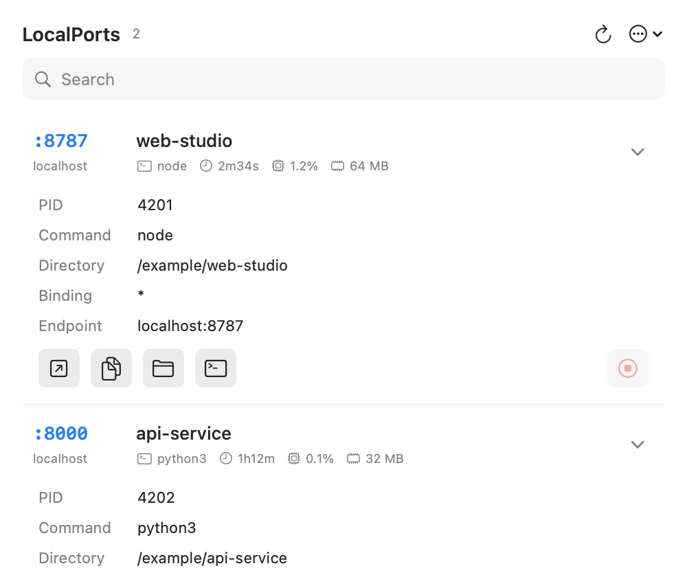

# LocalPorts

A native macOS menu-bar utility for seeing which processes are listening on TCP ports.
Built with Swift, AppKit and SwiftUI, with no third-party dependencies.

**macOS 13 or later · Intel (x86_64) · English-first · MIT**



*Synthetic demo rendered by LocalPorts: example processes, metrics and directories, not a real user's system. Light and [dark](docs/images/demo-dark.png) appearances are available. Scroll to reach details below the viewport.*

## Install

Download `LocalPorts-1.0.0-macOS-Intel.zip` and its `.sha256` file from
[Releases](https://github.com/chohcx/LocalPorts/releases). If a binary release is not available, build from source below.

```sh
shasum -a 256 -c LocalPorts-1.0.0-macOS-Intel.zip.sha256
```

Unzip, optionally drag `LocalPorts.app` into Applications, and open it. Click the menu-bar icon and count; there is no Dock icon. Use **Options → Quit LocalPorts** to exit.

The binary is **ad-hoc signed, not Developer ID signed or notarized**. Gatekeeper may block a downloaded copy. Only after verifying its source and checksum, use macOS **System Settings → Privacy & Security → Open Anyway**, if offered. Building locally is an alternative; do not disable Gatekeeper globally. Checksums detect corruption, not publisher identity.

The packaged build targets Intel and has been tested on macOS 13.7.6 with Swift 5.9.2. Apple Silicon is not a tested or distributed target. No administrator access, login item or background daemon is installed.

## Features

- Search by executable, project directory name, PID, address or port; optional developer-process name filter.
- Show port, host, executable, process uptime, CPU and resident memory. Expand a row for PID, directory, raw binding and endpoint.
- Open or copy an HTTP URL, reveal a directory in Finder, or open a **new** Terminal window there—not the original terminal tab.
- Stop an owned process with confirmation and a fresh UID/start-identity check. **Cancel is the default**; only SIGTERM is used, never automatic SIGKILL or privilege escalation.
- Quiet background polling: approximately every 2 seconds while open and 10 seconds while closed. No overlapping scans or polling animation.
- Fixed 500 × 430 pt panel with a 330 pt scroll viewport, full-row disclosure, brief interaction animations, light/dark appearance and Reduce Motion support.

## Build from source

Requires macOS 13+, Xcode or Command Line Tools with Swift 5.9+, and Python 3 for verification. System `lsof`, `ps`, `codesign` and `ditto` are used.

```sh
git clone https://github.com/chohcx/LocalPorts.git
cd LocalPorts
swift test
./scripts/build-app.sh
open dist/LocalPorts.app
```

To build, verify and package the Intel release:

```sh
./scripts/release.sh
```

Outputs are under `dist/`: the app, versioned ZIP and SHA-256 file. The script also checks the extracted archive's signature and bundle metadata. Generated artifacts and diagnostics are not source files and must not be committed.

## Tests

Run GUI checks in an interactive macOS login session (not a headless CI runner):

```sh
swift test
./scripts/build-app.sh
python3 scripts/verify_ui_contract.py
python3 scripts/verify_bundle.py dist/LocalPorts.app
python3 scripts/verify_layout.py dist/LocalPorts.app/Contents/MacOS/LocalPorts
python3 scripts/verify_jitter.py dist/LocalPorts.app/Contents/MacOS/LocalPorts
```

Unit/integration tests cover parsing, deduplication, search, endpoints, elapsed-time formatting, process identity and termination of a disposable test-owned server. Native checks cover status-item geometry/clicks, disclosure hit targets, clipboard behavior, fixed-window/header stability, intermediate animation frames and scroll access. Source contracts supplement—not replace—native tests. Browser/Finder/Terminal launches, the Options menu, keyboard navigation, hover appearance and the confirmation dialog still require manual acceptance checks; see [CONTRIBUTING.md](CONTRIBUTING.md).

`--diagnose` prints a JSON snapshot without opening the UI or stopping processes. **It can contain private executable and directory names**; review and redact before sharing. `scripts/measure_overhead.py` measures local overhead rather than claiming universal performance or energy impact.

## Limitations and safety

- TCP listeners visible to the current user's `lsof` permissions only; no UDP/UNIX sockets or privileged complete-system inventory. Short-lived listeners can be missed by polling.
- Developer classification is a filename heuristic, not framework detection. CPU is the `ps` statistic; uptime belongs to the process, not the port. Multiple rows for one PID repeat the same metrics—do not sum them.
- Binding preserves the actual interface. Display endpoints alias wildcard/loopback hosts to `localhost`; a wildcard does **not** imply loopback-only exposure. URL actions preserve explicit loopback IP families.
- URL actions assume HTTP. No TLS/protocol probing, custom-domain, proxy, tunnel or path-prefix discovery. Non-HTTP services may not work in a browser.
- Directory and identity information can be unavailable due to permissions or process exit. Unavailable directory actions are disabled.
- SIGTERM affects the entire process and all its ports, may lose unsaved work, and can be ignored. Identity is rechecked immediately before signaling, but the final check/kill race cannot be eliminated by this implementation.
- System-provided error messages follow the OS language; app-owned labels and errors are English.

## Privacy

Inspection runs locally. No telemetry, analytics, remote service, updater or full command-line/environment collection is implemented. It reads listener metadata, process identity, resource metrics and working directories. Opening a URL deliberately hands it to the default browser, which may make network requests. See [SECURITY.md](SECURITY.md).

## Project

- `Sources/PortsCore`: parsing, inspection, identity checks and presentation helpers.
- `Sources/LocalPorts`: native menu-bar app and deterministic UI evidence modes.
- `Tests/PortsCoreTests` and `scripts`: repeatable checks and packaging.

Independent implementation inspired by [Ports](https://www.ports-app.com/); not affiliated with or endorsed by its authors. No Ports artwork or code is included. Icons use macOS system SF Symbols at runtime; Apple assets are not separately redistributed or relicensed under MIT.

[MIT License](LICENSE) · [Contributing](CONTRIBUTING.md) · [Security](SECURITY.md)
